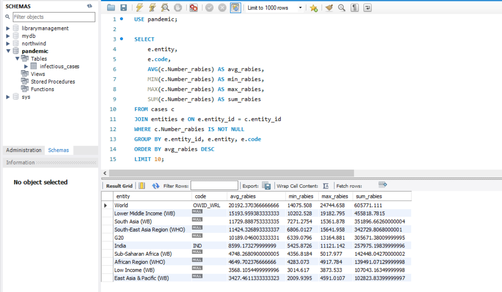
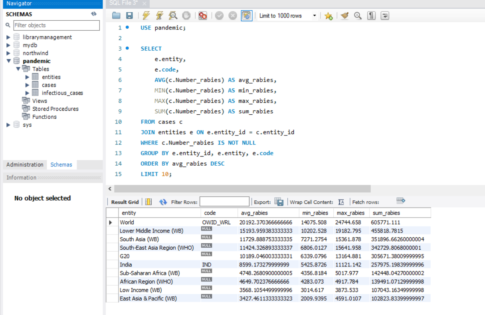
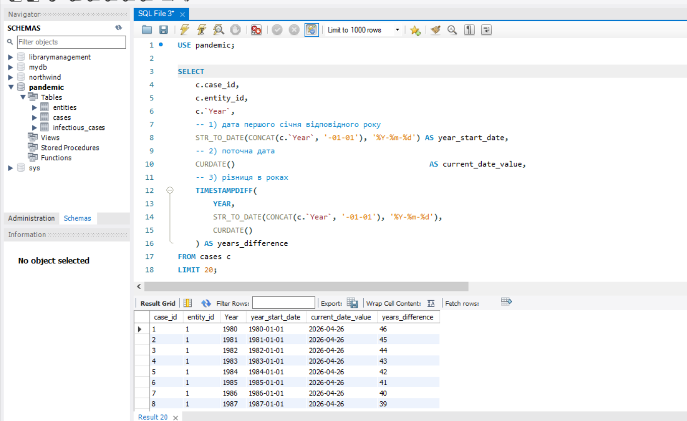
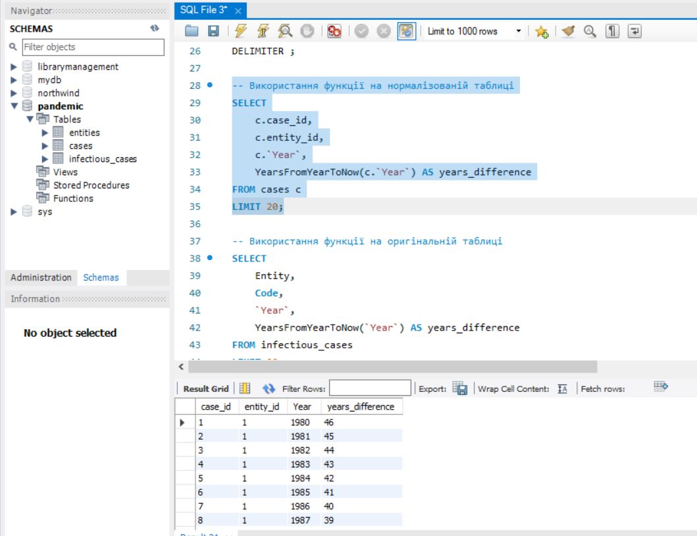
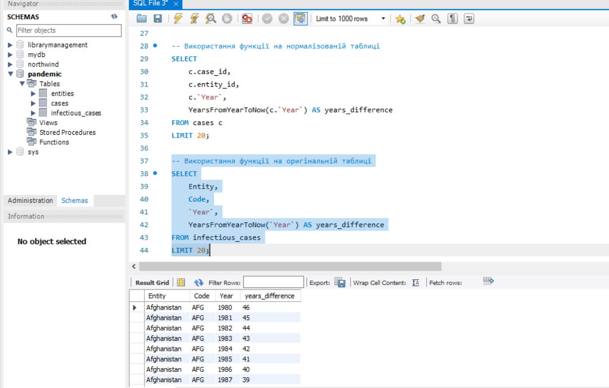
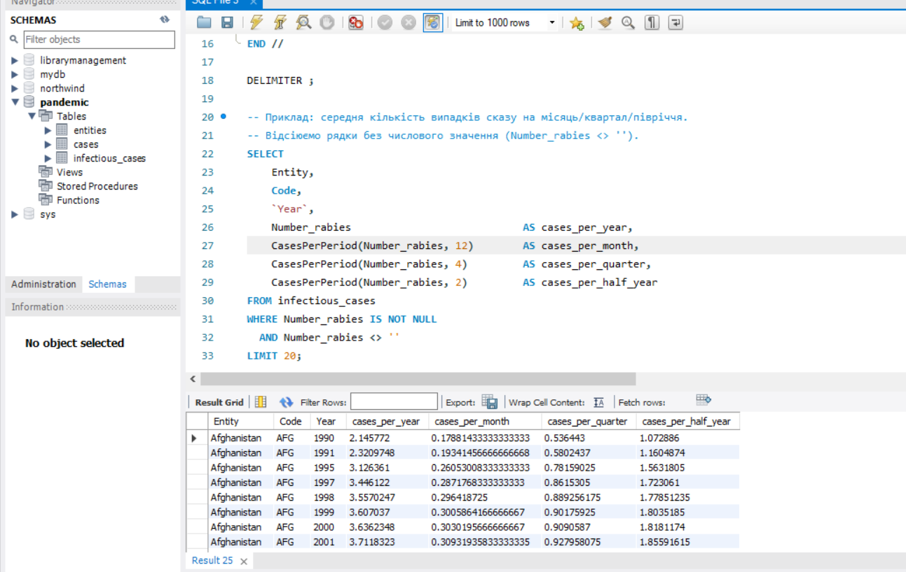

### 1. Схема та імпорт

Кількість завантажених записів: `SELECT COUNT(*) FROM infectious_cases;` → **10 521**.



Стандартний **Table Data Import Wizard** у MySQL Workbench часто втрачає рядки (у тестах було 7271 замість 10520) — він пропускає порожні значення у числових колонках. Тому використовувала `LOAD DATA LOCAL INFILE`. ( OPT_LOCAL_INFILE=1)


```sql
-- 1. Схема
CREATE SCHEMA IF NOT EXISTS pandemic;
USE pandemic;

SET GLOBAL local_infile = 1;

DROP TABLE IF EXISTS infectious_cases;
CREATE TABLE infectious_cases (
    Entity               VARCHAR(255),
    Code                 VARCHAR(16),
    `Year`               INT,
    Number_yaws          VARCHAR(64),
    polio_cases          VARCHAR(64),
    cases_guinea_worm    VARCHAR(64),
    Number_rabies        VARCHAR(64),
    Number_malaria       VARCHAR(64),
    Number_hiv           VARCHAR(64),
    Number_tuberculosis  VARCHAR(64),
    Number_smallpox      VARCHAR(64),
    Number_cholera_cases VARCHAR(64)
);

-- 4. Імпорт з файлу.
LOAD DATA LOCAL INFILE 'C:/Users/Tiara/Downloads/infectious_cases.csv'
INTO TABLE infectious_cases
FIELDS TERMINATED BY ','
OPTIONALLY ENCLOSED BY '"'
LINES TERMINATED BY '\n'
IGNORE 1 LINES;

-- 5. Перевірка
SELECT COUNT(*) AS total_records FROM infectious_cases;


## Завдання 2. Нормалізація до 3НФ

Атрибути Entity і Code повторюються для кожного року — це порушення 3НФ. Виносимо їх у довідник entities, а у таблиці фактів cases лишаємо entity_id як "FOREIGN KEY". Заодно конвертуємо текстові числові колонки у DOUBLE (порожні рядки стають "NULL").


```sql
USE pandemic;

-- Довідник entities: унікальні комбінації Entity та Code
DROP TABLE IF EXISTS cases;
DROP TABLE IF EXISTS entities;

CREATE TABLE entities (
    entity_id INT AUTO_INCREMENT PRIMARY KEY,
    entity    VARCHAR(255) NOT NULL,
    code      VARCHAR(16),
    UNIQUE KEY uq_entity_code (entity, code)
);

INSERT INTO entities (entity, code)
SELECT DISTINCT Entity, NULLIF(Code, '')
FROM infectious_cases;

-- Таблиця фактів cases: усі числові показники + посилання на entities
CREATE TABLE cases (
    case_id              INT AUTO_INCREMENT PRIMARY KEY,
    entity_id            INT NOT NULL,
    `Year`               INT NOT NULL,
    Number_yaws          DOUBLE,
    polio_cases          DOUBLE,
    cases_guinea_worm    DOUBLE,
    Number_rabies        DOUBLE,
    Number_malaria       DOUBLE,
    Number_hiv           DOUBLE,
    Number_tuberculosis  DOUBLE,
    Number_smallpox      DOUBLE,
    Number_cholera_cases DOUBLE,
    CONSTRAINT fk_cases_entity FOREIGN KEY (entity_id) REFERENCES entities(entity_id)
);

INSERT INTO cases (
    entity_id, `Year`, Number_yaws, polio_cases, cases_guinea_worm,
    Number_rabies, Number_malaria, Number_hiv, Number_tuberculosis,
    Number_smallpox, Number_cholera_cases
)
SELECT
    e.entity_id,
    ic.`Year`,
    NULLIF(ic.Number_yaws, '')          + 0,
    NULLIF(ic.polio_cases, '')          + 0,
    NULLIF(ic.cases_guinea_worm, '')    + 0,
    NULLIF(ic.Number_rabies, '')        + 0,
    NULLIF(ic.Number_malaria, '')       + 0,
    NULLIF(ic.Number_hiv, '')           + 0,
    NULLIF(ic.Number_tuberculosis, '')  + 0,
    NULLIF(ic.Number_smallpox, '')      + 0,
    NULLIF(ic.Number_cholera_cases, '') + 0
FROM infectious_cases ic
JOIN entities e
  ON e.entity = ic.Entity
 AND ((e.code = ic.Code) OR (e.code IS NULL AND ic.Code = ''));

-- Перевірка
SELECT COUNT(*) AS entities_count FROM entities;  -- 245
SELECT COUNT(*) AS cases_count    FROM cases;     -- 10520
SELECT * FROM entities LIMIT 10;
SELECT * FROM cases    LIMIT 10;
```

### Очікуваний результат
- `entities` — **245** рядків
- `cases` — **10521** рядків


## Завдання 3. Аналіз даних — агрегації по Number_rabies

```sql
USE pandemic;

SELECT
    e.entity,
    e.code,
    AVG(c.Number_rabies) AS avg_rabies,
    MIN(c.Number_rabies) AS min_rabies,
    MAX(c.Number_rabies) AS max_rabies,
    SUM(c.Number_rabies) AS sum_rabies
FROM cases c
JOIN entities e ON e.entity_id = c.entity_id
WHERE c.Number_rabies IS NOT NULL
GROUP BY e.entity_id, e.entity, e.code
ORDER BY avg_rabies DESC
LIMIT 10;



## Завдання 4. Колонка різниці в роках через вбудовані функції

```sql
USE pandemic;

SELECT
    c.case_id,
    c.entity_id,
    c.`Year`,
    -- 1) дата першого січня відповідного року
    STR_TO_DATE(CONCAT(c.`Year`, '-01-01'), '%Y-%m-%d') AS year_start_date,
    -- 2) поточна дата
    CURDATE()                                            AS current_date_value,
    -- 3) різниця в роках
    TIMESTAMPDIFF(
        YEAR,
        STR_TO_DATE(CONCAT(c.`Year`, '-01-01'), '%Y-%m-%d'),
        CURDATE()
    ) AS years_difference
FROM cases c
LIMIT 20;
```




## Завдання 5. Власна функція

```sql
USE pandemic;

-- Видаляємо функцію, якщо вона вже існує
DROP FUNCTION IF EXISTS YearsFromYearToNow;

DELIMITER //

CREATE FUNCTION YearsFromYearToNow(input_year INT)
RETURNS INT
DETERMINISTIC
READS SQL DATA
BEGIN
    DECLARE start_date DATE;
    DECLARE diff_years INT;

    -- Будуємо дату 1 січня переданого року
    SET start_date = STR_TO_DATE(CONCAT(input_year, '-01-01'), '%Y-%m-%d');

    -- Рахуємо різницю в роках між поточною датою і побудованою
    SET diff_years = TIMESTAMPDIFF(YEAR, start_date, CURDATE());

    RETURN diff_years;
END //

DELIMITER ;

-- Використання функції на нормалізованій таблиці
SELECT
    c.case_id,
    c.entity_id,
    c.`Year`,
    YearsFromYearToNow(c.`Year`) AS years_difference
FROM cases c
LIMIT 20;

-- Використання функції на оригінальній таблиці
SELECT
    Entity,
    Code,
    `Year`,
    YearsFromYearToNow(`Year`) AS years_difference
FROM infectious_cases
LIMIT 20;
---





## Альтернативна функція: кількість захворювань за період


USE pandemic;

DROP FUNCTION IF EXISTS CasesPerPeriod;

DELIMITER //

CREATE FUNCTION CasesPerPeriod(yearly_cases DOUBLE, divider INT)
RETURNS DOUBLE
DETERMINISTIC
BEGIN
    IF divider IS NULL OR divider = 0 THEN
        RETURN NULL;
    END IF;
    RETURN yearly_cases / divider;
END //

DELIMITER ;

-- Приклад: середня кількість випадків сказу на місяць/квартал/півріччя.
-- Відсіюємо рядки без числового значення (Number_rabies <> '').
SELECT
    Entity,
    Code,
    `Year`,
    Number_rabies                            AS cases_per_year,
    CasesPerPeriod(Number_rabies, 12)        AS cases_per_month,
    CasesPerPeriod(Number_rabies, 4)         AS cases_per_quarter,
    CasesPerPeriod(Number_rabies, 2)         AS cases_per_half_year
FROM infectious_cases
WHERE Number_rabies IS NOT NULL
  AND Number_rabies <> ''
LIMIT 20;



