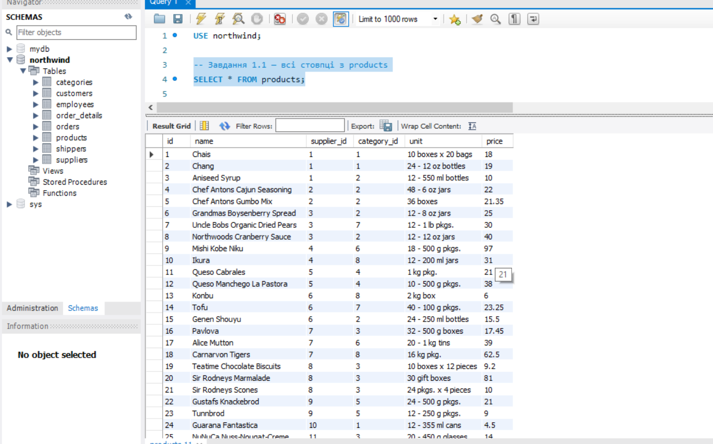
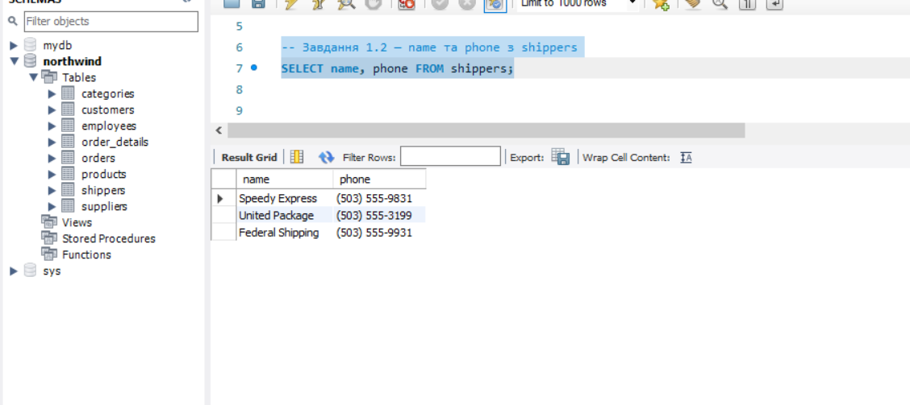
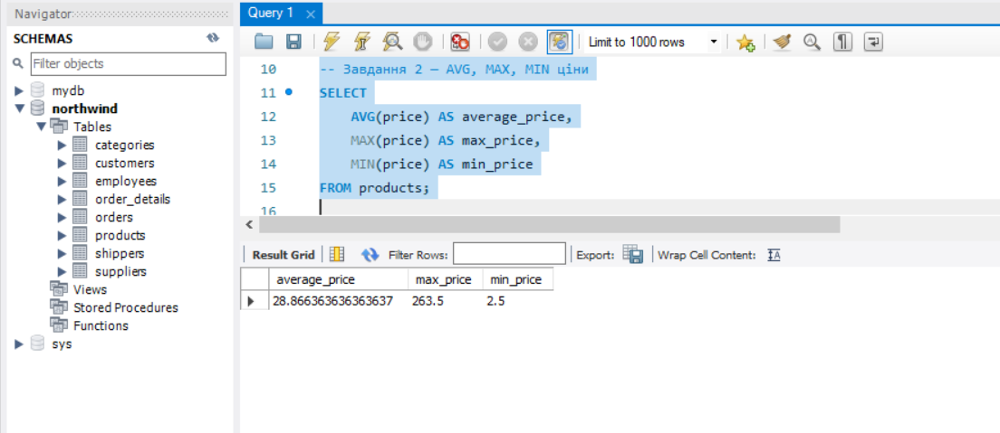
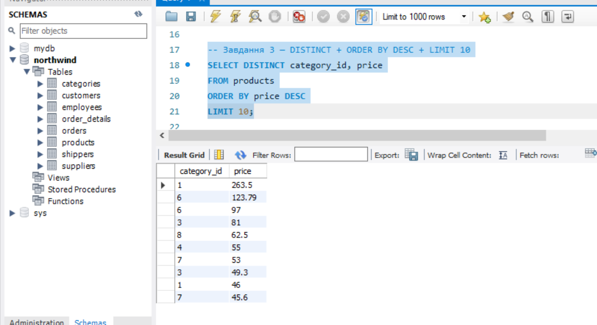
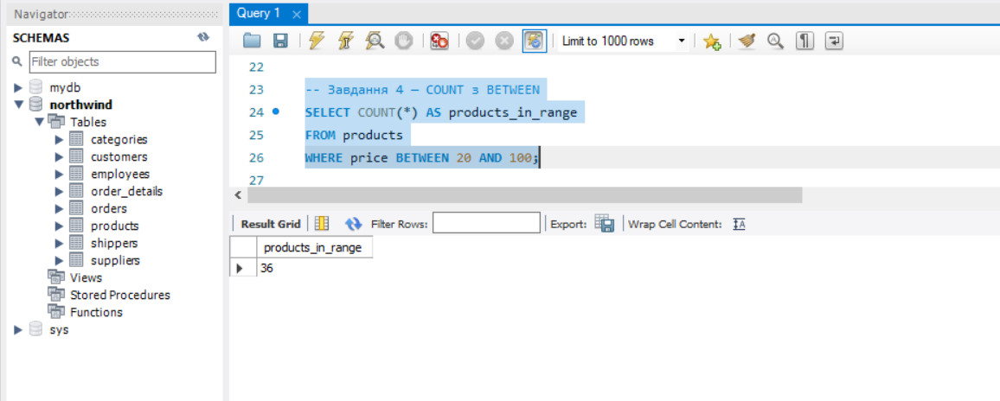
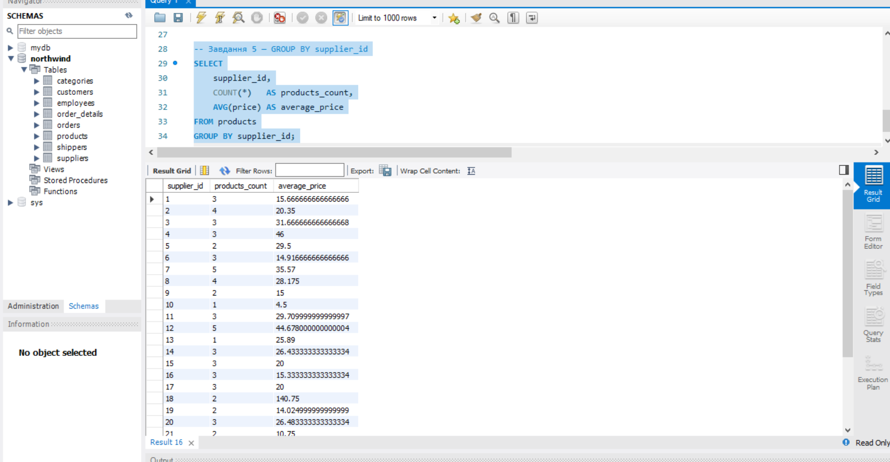

## Завдання 1. Вибірка стовпців з таблиць

### 1.1. Усі стовпці з таблиці `products` (через wildcard `*`)

SELECT * FROM products;

**Опис:** wildcard `*` повертає всі стовпці таблиці. Зручно для швидкого огляду структури та вмісту таблиці, але в продакшн-запитах рекомендується явно перелічувати потрібні поля для кращої продуктивності та читабельності.

### 1.2. Стовпці `name` та `phone` з таблиці `shippers`

SELECT name, phone FROM shippers;

**Опис:** перелічення конкретних стовпців через кому повертає тільки вказані поля. Це більш ефективно за `SELECT *`, особливо для широких таблиць.

## Завдання 2. Агрегатні функції: середнє, максимальне, мінімальне значення

SELECT
    AVG(price) AS average_price,
    MAX(price) AS max_price,
    MIN(price) AS min_price
FROM products;

## Завдання 3. Унікальні значення з сортуванням і обмеженням

SELECT DISTINCT category_id, price
FROM products
ORDER BY price DESC
LIMIT 10;

## Завдання 4. Кількість продуктів у заданому ціновому діапазоні

SELECT COUNT(*) AS products_in_range
FROM products
WHERE price BETWEEN 20 AND 100;

## Завдання 5. Кількість продуктів та середня ціна по постачальниках

SELECT
    supplier_id,
    COUNT(*)   AS products_count,
    AVG(price) AS average_price
FROM products
GROUP BY supplier_id;

