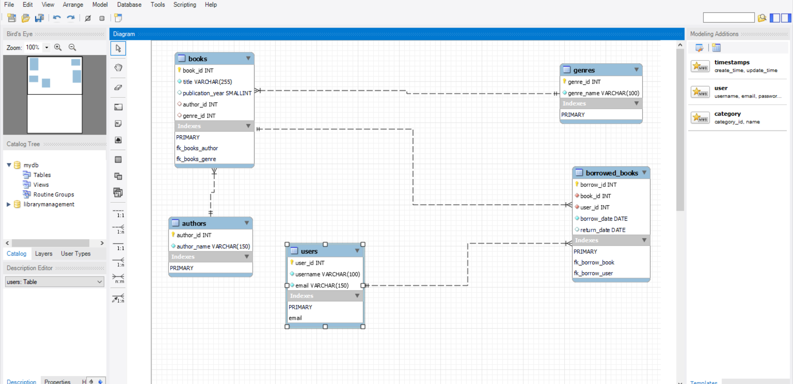
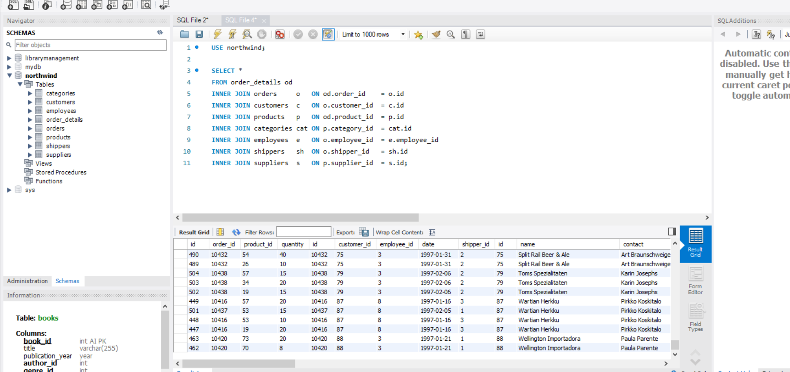
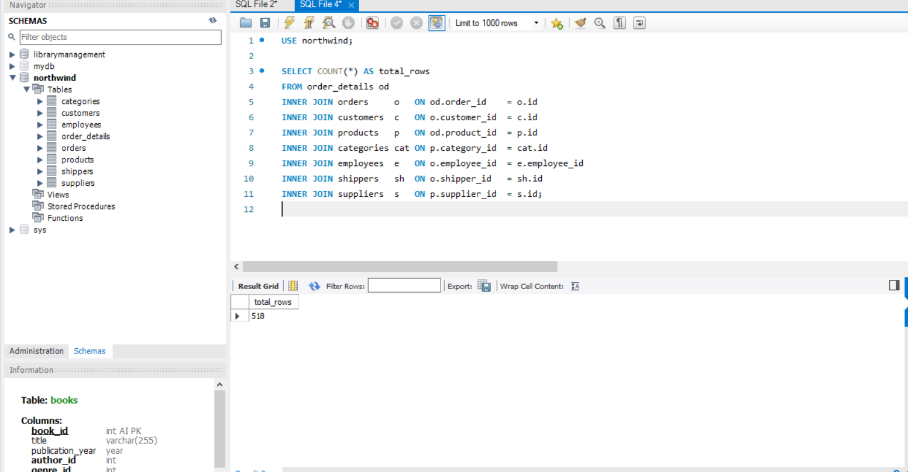
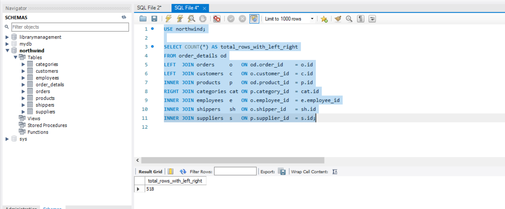
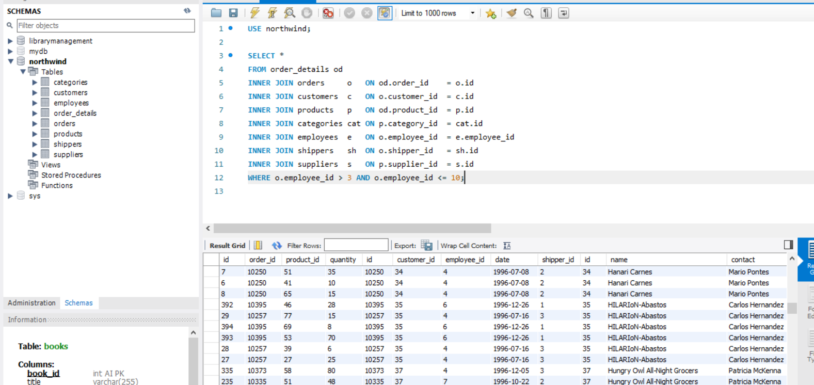
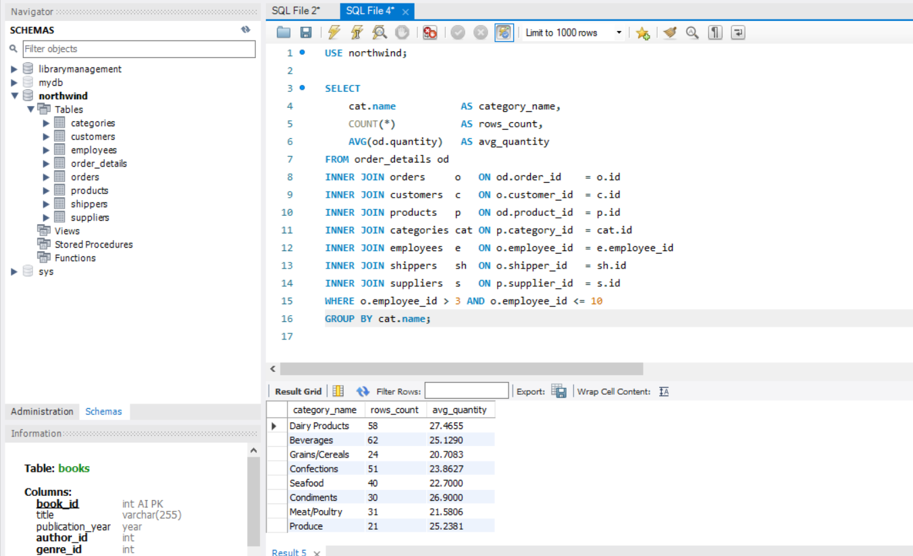
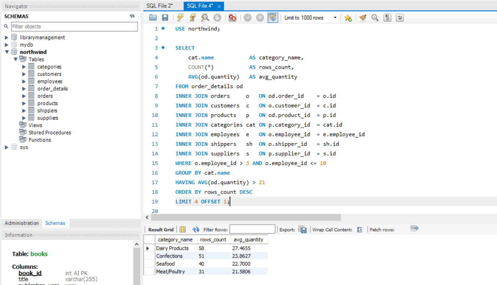

## Завдання 1. Створення бази `LibraryManagement`

Створено схему `LibraryManagement` з п'ятьма таблицями та зв'язками між ними за допомогою DDL-команд.

### Структура

| Таблиця | Опис | Зв'язки |
|---|---|---|
| `authors` | Автори книг | — |
| `genres` | Жанри книг | — |
| `books` | Книги | FK → `authors`, `genres` |
| `users` | Читачі | — |
| `borrowed_books` | Видачі книг | FK → `books`, `users` |

### SQL-скрипт

CREATE SCHEMA IF NOT EXISTS LibraryManagement
    CHARACTER SET utf8mb4
    COLLATE utf8mb4_unicode_ci;

USE LibraryManagement;

CREATE TABLE authors (
    author_id    INT AUTO_INCREMENT PRIMARY KEY,
    author_name  VARCHAR(150) NOT NULL
);

CREATE TABLE genres (
    genre_id    INT AUTO_INCREMENT PRIMARY KEY,
    genre_name  VARCHAR(100) NOT NULL
);

CREATE TABLE books (
    book_id           INT AUTO_INCREMENT PRIMARY KEY,
    title             VARCHAR(255) NOT NULL,
    publication_year  SMALLINT,
    author_id         INT,
    genre_id          INT,
    CONSTRAINT fk_books_author
        FOREIGN KEY (author_id) REFERENCES authors(author_id)
        ON UPDATE CASCADE ON DELETE SET NULL,
    CONSTRAINT fk_books_genre
        FOREIGN KEY (genre_id)  REFERENCES genres(genre_id)
        ON UPDATE CASCADE ON DELETE SET NULL
);

CREATE TABLE users (
    user_id   INT AUTO_INCREMENT PRIMARY KEY,
    username  VARCHAR(100) NOT NULL,
    email     VARCHAR(150) NOT NULL UNIQUE
);

CREATE TABLE borrowed_books (
    borrow_id    INT AUTO_INCREMENT PRIMARY KEY,
    book_id      INT NOT NULL,
    user_id      INT NOT NULL,
    borrow_date  DATE NOT NULL,
    return_date  DATE,
    CONSTRAINT fk_borrow_book
        FOREIGN KEY (book_id) REFERENCES books(book_id)
        ON UPDATE CASCADE ON DELETE CASCADE,
    CONSTRAINT fk_borrow_user
        FOREIGN KEY (user_id) REFERENCES users(user_id)
        ON UPDATE CASCADE ON DELETE CASCADE
);

### ER-діаграма

## Завдання 2. Заповнення таблиць тестовими даними

INSERT INTO authors (author_name) VALUES
    ('Тарас Шевченко'),
    ('Ліна Костенко'),
    ('George Orwell');

INSERT INTO genres (genre_name) VALUES
    ('Поезія'),
    ('Роман'),
    ('Антиутопія');

INSERT INTO books (title, publication_year, author_id, genre_id) VALUES
    ('Кобзар',       1840, 1, 1),
    ('Маруся Чурай', 1979, 2, 2),
    ('1984',         1949, 3, 3);

INSERT INTO users (username, email) VALUES
    ('ivan_petrenko',  'ivan@example.com'),
    ('olha_kovalenko', 'olha@example.com');

INSERT INTO borrowed_books (book_id, user_id, borrow_date, return_date) VALUES
    (1, 1, '2024-03-01', '2024-03-15'),
    (3, 2, '2024-03-10', NULL);

## Завдання 3. INNER JOIN усіх 8 таблиць Northwind

Об'єднано всі таблиці через спільні зовнішні ключі.

USE northwind;

SELECT *
FROM order_details od
INNER JOIN orders     o   ON od.order_id    = o.id
INNER JOIN customers  c   ON o.customer_id  = c.id
INNER JOIN products   p   ON od.product_id  = p.id
INNER JOIN categories cat ON p.category_id  = cat.id
INNER JOIN employees  e   ON o.employee_id  = e.employee_id
INNER JOIN shippers   sh  ON o.shipper_id   = sh.id
INNER JOIN suppliers  s   ON p.supplier_id  = s.id;

**Спільні ключі:**

| Зв'язок | Ліва таблиця | Права таблиця |
|---|---|---|
| 1 | `order_details.order_id` | `orders.id` |
| 2 | `orders.customer_id` | `customers.id` |
| 3 | `order_details.product_id` | `products.id` |
| 4 | `products.category_id` | `categories.id` |
| 5 | `orders.employee_id` | `employees.employee_id` |
| 6 | `orders.shipper_id` | `shippers.id` |
| 7 | `products.supplier_id` | `suppliers.id` |

## Завдання 4. Аналітичні запити

### 4.1. Кількість рядків (`COUNT`)

SELECT COUNT(*) AS total_rows
FROM order_details od
INNER JOIN orders     o   ON od.order_id    = o.id
INNER JOIN customers  c   ON o.customer_id  = c.id
INNER JOIN products   p   ON od.product_id  = p.id
INNER JOIN categories cat ON p.category_id  = cat.id
INNER JOIN employees  e   ON o.employee_id  = e.employee_id
INNER JOIN shippers   sh  ON o.shipper_id   = sh.id
INNER JOIN suppliers  s   ON p.supplier_id  = s.id;

### 4.2. Заміна INNER на LEFT/RIGHT JOIN

SELECT COUNT(*) AS total_rows_with_left_right
FROM order_details od
LEFT  JOIN orders     o   ON od.order_id    = o.id
LEFT  JOIN customers  c   ON o.customer_id  = c.id
INNER JOIN products   p   ON od.product_id  = p.id
RIGHT JOIN categories cat ON p.category_id  = cat.id
INNER JOIN employees  e   ON o.employee_id  = e.employee_id
INNER JOIN shippers   sh  ON o.shipper_id   = sh.id
INNER JOIN suppliers  s   ON p.supplier_id  = s.id;

#### Чому змінюється кількість рядків

Як працюють різні типи JOIN:

- **INNER JOIN** — повертає тільки ті рядки, для яких є збіг ключів в обох таблицях. Рядки без відповідника відкидаються.
- **LEFT JOIN** — повертає всі рядки з лівої таблиці. Якщо у правій немає збігу — стовпці правої таблиці заповнюються `NULL`.
- **RIGHT JOIN** — повертає всі рядки з правої таблиці. Якщо у лівій немає збігу — стовпці лівої таблиці заповнюються `NULL`.

**Що відбувається в запиті:**

У базі Northwind є повна референційна цілісність — кожен запис в `order_details` має валідні `order_id` і `product_id`, кожне замовлення має `customer_id`, `employee_id`, `shipper_id`, кожен продукт має `category_id` і `supplier_id`. Висячих записів без зв'язків немає.

Через це `INNER JOIN` і `LEFT JOIN` (де ліва таблиця — `order_details`) повертають **однакову** кількість рядків.

Однак `RIGHT JOIN` на `categories` може **збільшити** кількість рядків, якщо в таблиці `categories` існують категорії, для яких немає жодного продукту в замовленнях. У такому випадку для цих категорій з'являться рядки з `NULL` у всіх інших стовпцях.

**Загальне правило:**

INNER JOIN  ≤  LEFT/RIGHT JOIN  ≤  FULL OUTER JOIN

Кількість рядків ніколи не зменшується при переході від `INNER` до `OUTER` JOIN — вона може лише збільшитися або залишитися такою ж.

### 4.3. Фільтрація по `employee_id`

Вибрано тільки рядки, де `employee_id > 3` та `≤ 10`.

SELECT *
FROM order_details od
INNER JOIN orders     o   ON od.order_id    = o.id
INNER JOIN customers  c   ON o.customer_id  = c.id
INNER JOIN products   p   ON od.product_id  = p.id
INNER JOIN categories cat ON p.category_id  = cat.id
INNER JOIN employees  e   ON o.employee_id  = e.employee_id
INNER JOIN shippers   sh  ON o.shipper_id   = sh.id
INNER JOIN suppliers  s   ON p.supplier_id  = s.id
WHERE o.employee_id > 3 AND o.employee_id <= 10;

### 4.4. Групування по категорії

Згруповано за іменем категорії, підраховано кількість рядків у групі та середню кількість товару (`order_details.quantity`).

SELECT
    cat.name           AS category_name,
    COUNT(*)           AS rows_count,
    AVG(od.quantity)   AS avg_quantity
FROM order_details od
INNER JOIN orders     o   ON od.order_id    = o.id
INNER JOIN customers  c   ON o.customer_id  = c.id
INNER JOIN products   p   ON od.product_id  = p.id
INNER JOIN categories cat ON p.category_id  = cat.id
INNER JOIN employees  e   ON o.employee_id  = e.employee_id
INNER JOIN shippers   sh  ON o.shipper_id   = sh.id
INNER JOIN suppliers  s   ON p.supplier_id  = s.id
WHERE o.employee_id > 3 AND o.employee_id <= 10
GROUP BY cat.name;

### 4.5–4.7. HAVING + ORDER BY DESC + LIMIT з OFFSET

Додано три фінальні умови до попереднього запиту:

- **4.5** — фільтр на групи із середньою кількістю товару > 21 (`HAVING`)
- **4.6** — сортування за спаданням кількості рядків (`ORDER BY ... DESC`)
- **4.7** — 4 рядки з пропущеним першим (`LIMIT 4 OFFSET 1`)

SELECT
    cat.name           AS category_name,
    COUNT(*)           AS rows_count,
    AVG(od.quantity)   AS avg_quantity
FROM order_details od
INNER JOIN orders     o   ON od.order_id    = o.id
INNER JOIN customers  c   ON o.customer_id  = c.id
INNER JOIN products   p   ON od.product_id  = p.id
INNER JOIN categories cat ON p.category_id  = cat.id
INNER JOIN employees  e   ON o.employee_id  = e.employee_id
INNER JOIN shippers   sh  ON o.shipper_id   = sh.id
INNER JOIN suppliers  s   ON p.supplier_id  = s.id
WHERE o.employee_id > 3 AND o.employee_id <= 10
GROUP BY cat.name
HAVING AVG(od.quantity) > 21
ORDER BY rows_count DESC
LIMIT 4 OFFSET 1;

