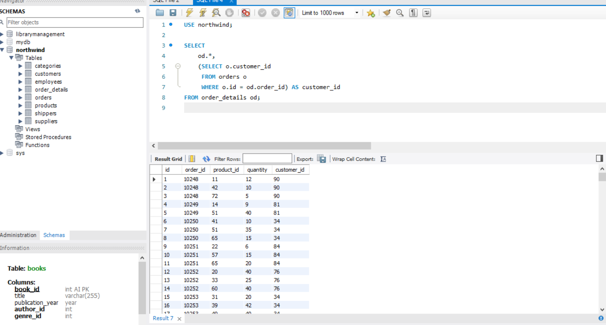
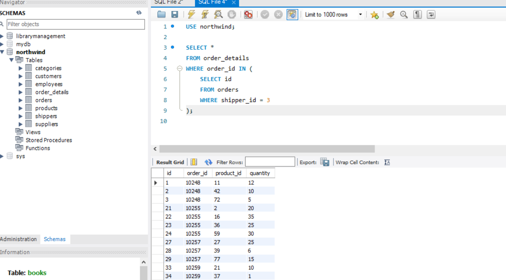
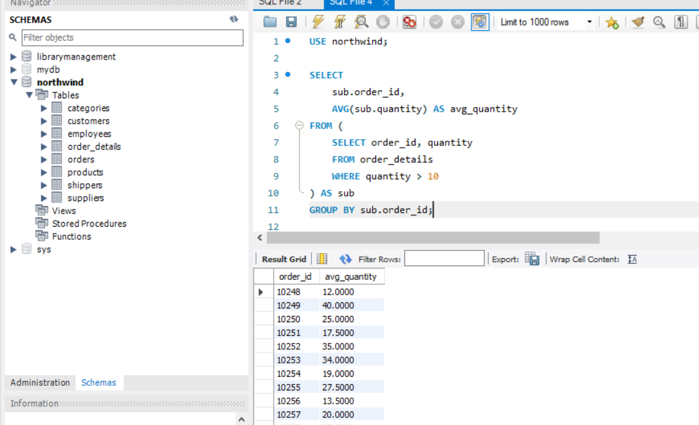
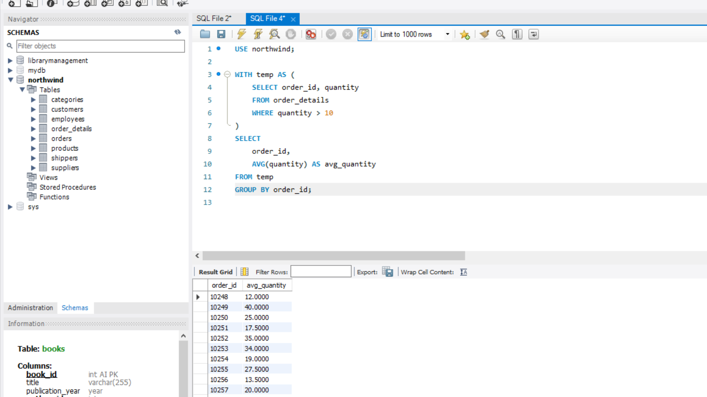
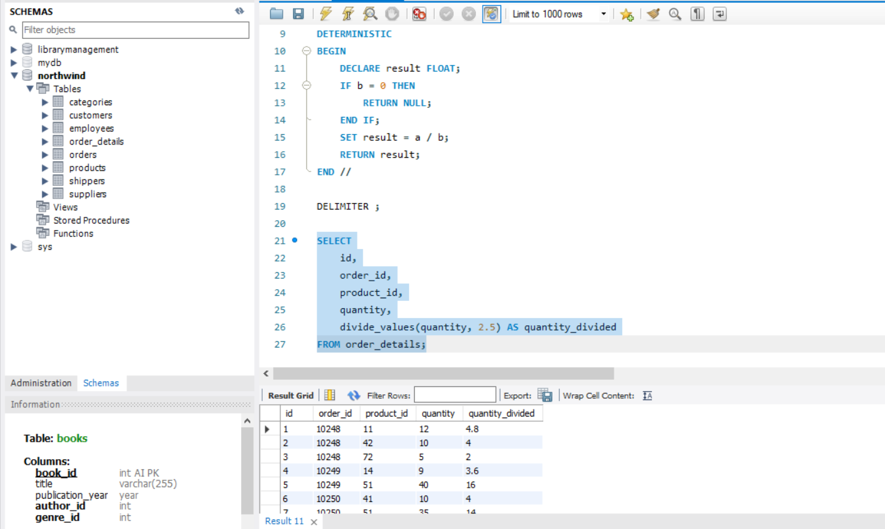

## Завдання 1. Subquery в SELECT

Відображення таблиці `order_details` з додатковим полем `customer_id` з таблиці `orders` для кожного запису. Реалізовано через вкладений запит у `SELECT`.

```sql
SELECT
    od.*,
    (SELECT o.customer_id
     FROM orders o
     WHERE o.id = od.order_id) AS customer_id
FROM order_details od;
```



## Завдання 2. Subquery в WHERE

Відображення `order_details` тільки для тих записів, у яких відповідне замовлення має `shipper_id = 3`. Реалізовано через вкладений запит у `WHERE`.

```sql
SELECT *
FROM order_details
WHERE order_id IN (
    SELECT id
    FROM orders
    WHERE shipper_id = 3
);
```



## Завдання 3. Subquery в FROM

Спочатку відбираємо рядки з `quantity > 10` з `order_details` (через підзапит у `FROM`), потім групуємо результат за `order_id` та обчислюємо середнє значення `quantity`.

```sql
SELECT
    sub.order_id,
    AVG(sub.quantity) AS avg_quantity
FROM (
    SELECT order_id, quantity
    FROM order_details
    WHERE quantity > 10
) AS sub
GROUP BY sub.order_id;
```



## Завдання 4. Те саме через CTE (WITH)

Те саме завдання, що й 3, але реалізовано через **Common Table Expression** — тимчасову іменовану таблицю, що існує лише в межах одного запиту.

```sql
WITH temp AS (
    SELECT order_id, quantity
    FROM order_details
    WHERE quantity > 10
)
SELECT
    order_id,
    AVG(quantity) AS avg_quantity
FROM temp
GROUP BY order_id;
```



## Завдання 5. Збережена функція

Створено функцію `divide_values`, яка приймає два параметри типу `FLOAT` і повертає результат їх ділення. Використано конструкцію `DROP FUNCTION IF EXISTS` для безпечного перестворення функції.

```sql
DROP FUNCTION IF EXISTS divide_values;

DELIMITER //

CREATE FUNCTION divide_values(a FLOAT, b FLOAT)
RETURNS FLOAT
DETERMINISTIC
BEGIN
    DECLARE result FLOAT;
    IF b = 0 THEN
        RETURN NULL;
    END IF;
    SET result = a / b;
    RETURN result;
END //

DELIMITER ;
```
**Пояснення конструкцій:**

- `DROP FUNCTION IF EXISTS` — видаляє функцію, якщо вона вже існує (захист від помилки повторного створення)
- `DELIMITER //` — тимчасово змінює розділювач команд із `;` на `//`, щоб MySQL не сприймав крапки з комою всередині тіла функції як кінець команди
- `DETERMINISTIC` — позначка, що функція завжди повертає однаковий результат для однакових аргументів
- Перевірка `IF b = 0 THEN RETURN NULL` — захист від ділення на нуль

### Застосування функції до атрибута `quantity`

```sql
SELECT
    id,
    order_id,
    product_id,
    quantity,
    divide_values(quantity, 2.5) AS quantity_divided
FROM order_details;
```

Функція ділить значення `quantity` кожного рядка на `2.5` і повертає результат у новій колонці.

