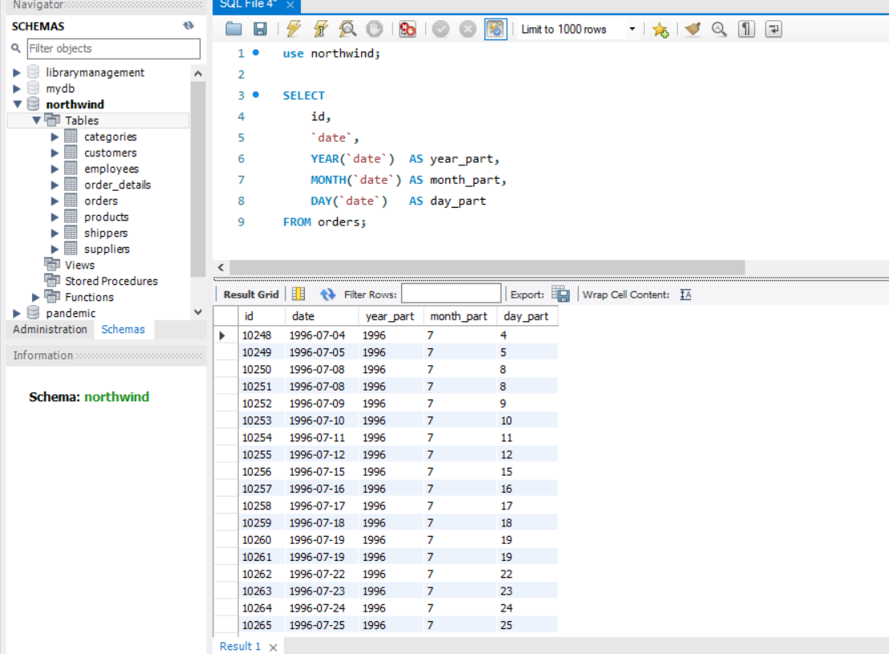
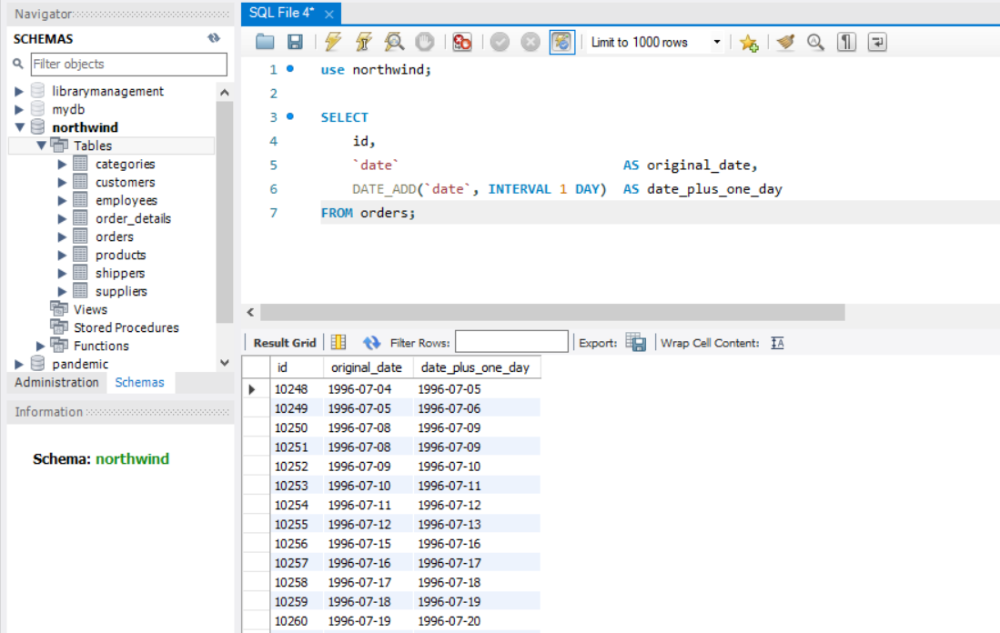
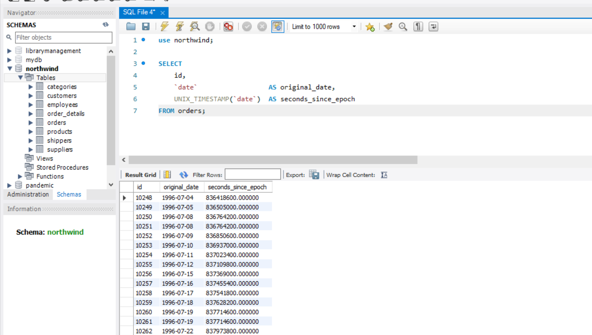
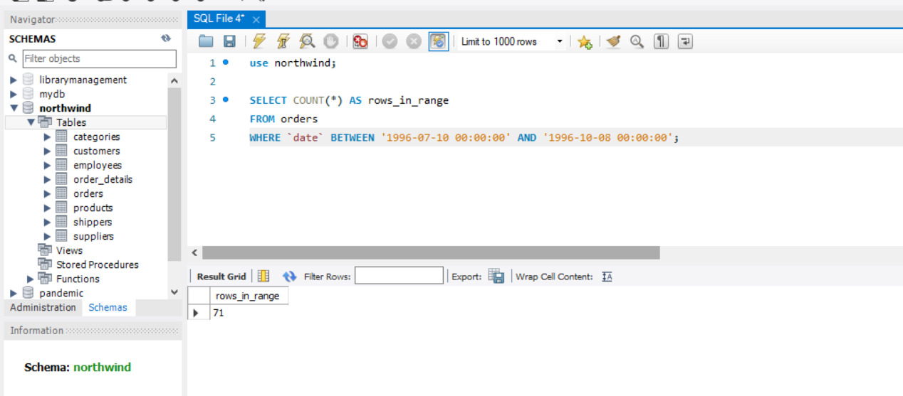
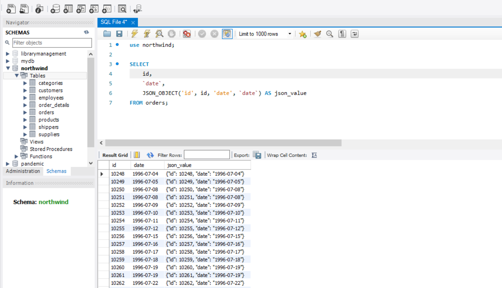

## Завдання 1. Витягнути рік, місяць, число

```sql
SELECT
    id,
    `date`,
    YEAR(`date`)  AS year_part,
    MONTH(`date`) AS month_part,
    DAY(`date`)   AS day_part
FROM orders;
```




## Завдання 2. Додати один день

```sql
SELECT
    id,
    `date`                            AS original_date,
    DATE_ADD(`date`, INTERVAL 1 DAY)  AS date_plus_one_day
FROM orders;
```




## Завдання 3. Timestamp (секунди з початку відліку)
Перетворюємо `date` у Unix timestamp — кількість секунд від `1970-01-01 00:00:00 UTC`.

```sql
SELECT
    id,
    `date`                  AS original_date,
    UNIX_TIMESTAMP(`date`)  AS seconds_since_epoch
FROM orders;
```




## Завдання 4. Кількість рядків у діапазоні дат

```sql
SELECT COUNT(*) AS rows_in_range
FROM orders
WHERE `date` BETWEEN '1996-07-10 00:00:00' AND '1996-10-08 00:00:00';
```




## Завдання 5. JSON-об'єкт з id та date

```sql
SELECT
    id,
    `date`,
    JSON_OBJECT('id', id, 'date', `date`) AS json_value
FROM orders;
```

